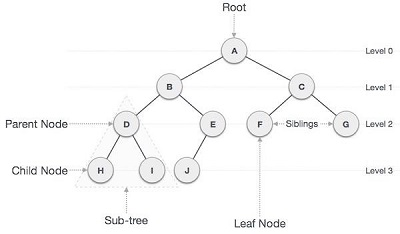

# Trees
Trees are hierarchical data structures consisting of nodes connected by pointers, forming a parent-child relationship. Each tree has a root node as the starting point, and all other nodes are connected to it. Nodes without children are called leaves. Trees are widely used to represent hierarchical data, such as file systems and organizational charts.


## Types of Trees

### Binary Trees
A binary tree is a tree where each node can have at most two children, often called the left child and the right child. Binary trees are useful for organizing data and implementing algorithms. Each node can have two child nodes at most, but it's not required to have both.


### Binary Search Trees (BST)
A binary search tree (BST) is a specific type of binary tree that follows a particular ordering rule. For every node in the tree, all nodes in its left subtree have values less than the node's value, and all nodes in its right subtree have values greater than the node's value. This property enables efficient searching, insertion, and deletion operations.

The key characteristic of BSTs is the ability to perform binary search. Starting from the root node, we compare the value we are searching for with the value of the current node. Based on the comparison, we move left or right in the tree until we find the desired value or reach a leaf node, indicating that the value is not present in the tree.




## BST in Python
In Python, we can implement a binary search tree using classes. Each node in the tree will be represented as an instance of a class. The class will have attributes to store data and references to its left and right children.

### Common BST Operations and Their Performance

| Operation          | Description                                            | Performance                                          |
|--------------------|--------------------------------------------------------|------------------------------------------------------|
| `insert(value)`    | Insert a value into the tree.                         | O(log n) - Recursively search the subtrees to find the next available spot. |
| `remove(value)`    | Remove a value from the tree.                         | O(log n) - Recursively search the subtrees to find the value and then remove it. This will require some cleanup of the adjacent nodes. |
| `contains(value)`  | Determine if a value is in the tree.                  | O(log n) - Recursively search the subtrees to find the value. |
| `traverse_forward` | Visit all objects from smallest to largest.           | O(n) - Recursively traverse the left subtree and then the right subtree. |
| `traverse_reverse` | Visit all objects from largest to smallest.           | O(n) - Recursively traverse the right subtree and then the left subtree. |
| `height(node)`     | Determine the height of a node. If the height of the tree is needed, the root node is provided. | O(n) - Recursively find the height of the left and right subtrees and then return the maximum height (plus one to account for the root). |
| `size()`           | Return the size of the BST.                           | O(1) - The size is maintained within the BST class. |
| `empty()`          | Returns true if the root node is empty. This can also be done by checking the size for 0. | O(1) - The comparison of the root node or the size. |


### Inserting into a BST
``` Python
class MyTree:
    def __init__(self):
        self.root = None

    class TreeNode:
        def __init__(self, value):
            self.value = value
            self.left = None
            self.right = None

    def insert(self, value):
        if not self.root:
            self.root = MyTree.TreeNode(value)
        else:
            self._insert(self.root, value)

    def _insert(self, node, value):
        if value < node.value:
            if not node.left:
                node.left = MyTree.TreeNode(value)
            else:
                self._insert(node.left, value)
        else:
            if not node.right:
                node.right = MyTree.TreeNode(value)
            else:
                self._insert(node.right, value)
```

### Deleting in a BST
``` Python
    def delete(self, value):
        self.root = self._delete(self.root, value)

    def _delete(self, node, value):
        if not node:
            return node

        if value < node.value:
            node.left = self._delete(node.left, value)
        elif value > node.value:
            node.right = self._delete(node.right, value)
        else:
            if not node.left:
                return node.right
            elif not node.right:
                return node.left

            temp = self._find_min_value_node(node.right)
            node.value = temp.value
            node.right = self._delete(node.right, temp.value)
        return node
```

### Searching in a BST
``` Python
    def search(self, value):
        return self._search(self.root, value)

    def _search(self, node, value):
        if not node or node.value == value:
            return node
        if value < node.value:
            return self._search(node.left, value)
        return self._search(node.right, value)
```

### Traversing a BST
``` Python
    def forward_traversal(self):
        self._forward_traversal(self.root)

    def _forward_traversal(self, node):
        if node:
            self._forward_traversal(node.left)
            print(node.value, end=" ")
            self._forward_traversal(node.right)

    def backward_traversal(self):
        self._backward_traversal(self.root)

    def _backward_traversal(self, node):
        if node:
            self._backward_traversal(node.right)
            print(node.value, end=" ")
            self._backward_traversal(node.left)
```

## Problem to Solve: Work with Tree operations
In this section, you will work with binary search trees (BST) and perform basic operations like insertion, search, and deletion of nodes, as well as forward and backward traversals.

### Tasks
* Implement the `forwardTraversal` function
* Implement the `_backwardTraversal` function

``` python
class MyTreeNode:
    def __init__(self, value):
        self.value = value
        self.left = None
        self.right = None

class MyTree:
    def __init__(self):
        self.root = None

    def insert(self, value):
        self.root = self._insert(self.root, value)

    def _insert(self, root, value):
        if root is None:
            return MyTreeNode(value)
        if value < root.value:
            root.left = self._insert(root.left, value)
        else:
            root.right = self._insert(root.right, value)
        return root

    def search(self, value):
        return self._search(self.root, value)

    def _search(self, root, value):
        if root is None or root.value == value:
            return root
        if value < root.value:
            return self._search(root.left, value)
        return self._search(root.right, value)

    def delete(self, value):
        self.root = self._delete(self.root, value)

    def _delete(self, root, value):
        if root is None:
            return root

        if value < root.value:
            root.left = self._delete(root.left, value)
        elif value > root.value:
            root.right = self._delete(root.right, value)
        else:
            if root.left is None:
                return root.right
            elif root.right is None:
                return root.left

            temp = self._minValueNode(root.right)
            root.value = temp.value
            root.right = self._delete(root.right, temp.value)
        return root

    def _minValueNode(self, node):
        current = node
        while current.left is not None:
            current = current.left
        return current

    def forwardTraversal(self):
        pass

    def _forwardTraversal(self, root):
        if root:
            self._forwardTraversal(root.left)
            print(root.value, end=" ")
            self._forwardTraversal(root.right)

    def backwardTraversal(self):
        self._backwardTraversal(self.root)

    def _backwardTraversal(self, root):
        pass


# Test Scenario 1: Create the binary search tree

# Test Scenario 2: Insert values one by one into the BST

# Test Scenario 3: Search for a value in the BST

# Test Scenario 4: Delete a value from the BST

# Test Scenario 5: Perform forward traversal to print the BST elements in ascending order

# Test Scenario 6: Perform backward traversal to print the BST elements in descending order
```

### Test 1:
* Create a new binary tree

### Test 2:
* Insert values into the binary tree

### Test 3:
* Search a value in the dinary tree

### Test 4:
* Delete a value in the binary tree

### Test 5:
* Perform a BTS forward traversal

### Test 6:
* Perform a BTS backward traversal

You can check your code with the solution here: [Solution](trees.py)